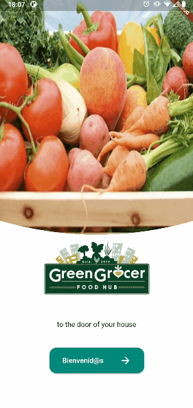

<h1 align="center">Welcome</h1>

 

  Hello! 👋🏻  
  Welcome to my GitHub profile. I'm Luciano Ojeda, a passionate Full Stack Developer with a love for programming, technology, and problem-solving. With experience in the software and consulting industries, I have worked on web development and mobile application projects using a broad range of technologies.

<h2 align="left">🚀 What am I currently doing?</h2>
<ul>
  <li>👨🏻‍💻 I am a Software Engineer at Blue Alba, where I engage in the full software development lifecycle for financial applications.</li>
  <li>💼 Previously, I worked as a Front End Developer at VFG, developing mobile apps with React Native and enhancing user experiences.</li>
  <li>🤺 I am currently enhancing my skills in artificial intelligence while continuously seeking new challenges in software development.</li>
</ul>

<h2 align="left">💻 My Favorite Technologies:</h2>
<ul>
  <li><strong>Programming Languages:</strong> JavaScript, TypeScript, Dart, Python, Java, SQL</li>
  <li><strong>Frameworks:</strong> React, React Native, Next.js, NestJS, Django</li>
  <li><strong>Databases:</strong> PostgreSQL, MySQL, MongoDB</li>
  <li><strong>DevOps:</strong> AWS, Docker, CI/CD</li>
  <li><strong>Testing:</strong> Cypress, Jest</li>
</ul>

  Feel free to explore my work and reach out!  
  🌐 <a href="https://portafolio-virid-two.vercel.app/" target="blank">Portfolio</a> | 
  <a href="https://github.com/lucianoojeda36/lucianoojeda36" target="blank">GitHub</a> | 
  <a href="https://www.linkedin.com/in/lucianoojeda/" target="blank">LinkedIn</a>

<h2 align="left">📂 Projects</h2>
 
<h4 align="left">COOK BOOK REACT NATIVE</h4>

  

<h4 align="left">GREEN GROCERY FLUTTER</h4>

  

<h4 align="left">ECOMMERCE DELIVERY FOOD</h4>

  

<h4 align="left">CLON-NETFLIX</h4>

 

<h2 align="left">📫 Contact me:</h2>

  
  

 

<h2 align="left">🛠️ Languages and Tools:</h2>

  
  
  
  
  
  
  
  
  
  
  
  
  
  
  
  
  
  
  
  
  

<h2 align="left">📝 My latest blog posts:</h2>
<ul>
  <li><a href="https://medium.com/@lucianoojeda36/10-trucos-de-react-para-ser-mas-efectivo-6b66fcd7b933" target="blank">10 Trucos de React para ser más efectivo</a></li>
  <li><a href="https://medium.com/@lucianoojeda36/comparativa-entre-react-native-y-flutter-a7bc582665aa" target="blank">Comparativa entre React Native y Flutter</a></li>
</ul>

Thank you for visiting my profile! 😊

