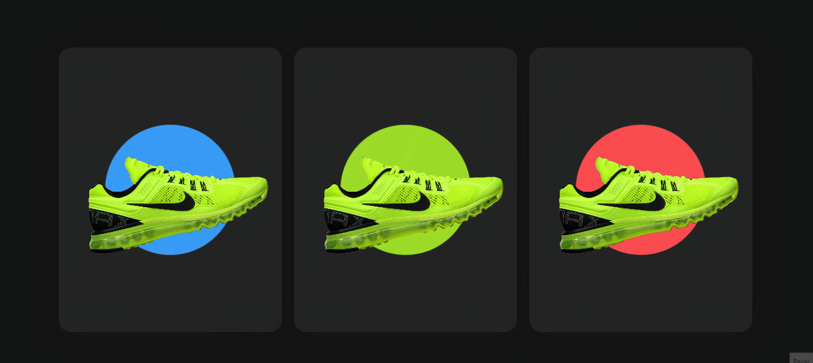
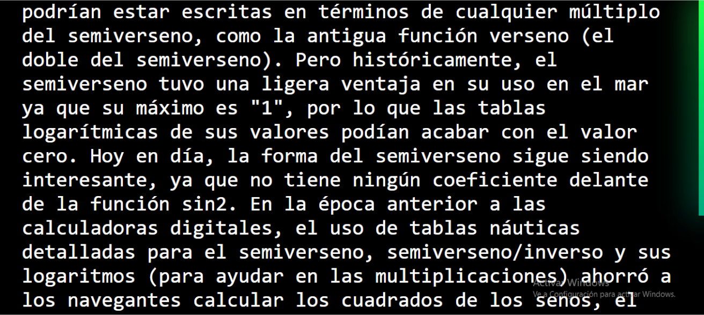

  <h1 align = "center" >Welcome</h1>
  
   
  

   <b>
    Hi, I'm Luciano — a Full Stack Web Developer and a Civil Engineer. My working principle is learning by doing. 💯
   </b>
  

 <h3 align = "left"> Projects </h3>
   
  <h5 align = "left"> COOK BOOK REACT NATVIE </h5>

  

  
 <h5 align = "left"> ECOMERCE DELIVIRY FOOD </h5>

 

 <h5 align = "left"> CLON-NETFLIX </h5>

 

 <h5 align = "left"> CARDS-3D </h5>

 

  
 <!-- <h5 align = "left"> SCROLL-NEON </h5>

 <!--   -->

<h3 align = "left"> Contact me: </h3>

 
<h3 align = "left"> Languages ​​and tools: </h3>

 
 
 

 
 
 

